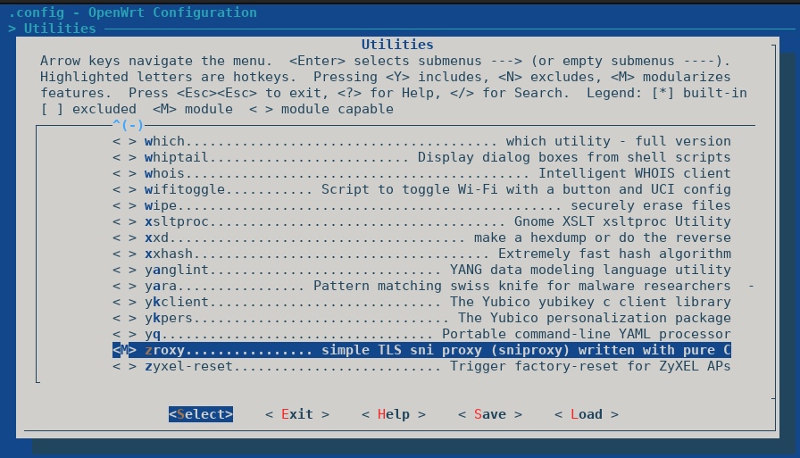

## Add zroxy Package to OpenWRT

```warning: zroxy is a simple sni proxy and maybe it's not optimized to use in your ruter!```

for use zroxy in your router, you need add zroxy to openwrt package and then cross-compile it for your router articture.

in first step we clone openwrt from source:
```
git clone https://git.openwrt.org/openwrt/openwrt.git
cd openwrt
```

Select a specific code revision:
```
git branch -a
git tag
git checkout v21.02.3
```

Update the feeds:
```
./scripts/feeds update -a
./scripts/feeds install -a
```
now copy the zroxy makefile to openwrt:
```
mkdir <openwrt-path>/package/utils/zroxy

cp <zroxy-path>/openwrt/Makefile  <openwrt-path>/package/utils/zroxy/Makefile
```

Configure the firmware image and the kernel and from Utilities enable zroxy:

```
make menuconfig

make -j$(nproc)
```
